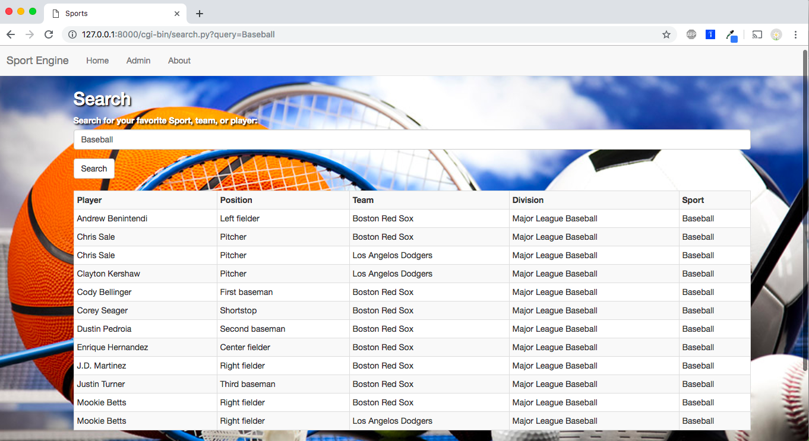

# Sports Web site and Administration

## Class information
CST363: Database Systems - Project 1.1  at CSUMB: Web app using CGI scripts, MySQL, HTML, CSS

## Application configuration
Application configuration is stored in **appconfig.py** file. Set desired MySQL connection configuration there (database_* parameters). 

## Starting the web server
Make sure you use Python of version 3.
```shell
cd [DIRECTORY_OF_WEB_PROJECT]
python httpserver.py
```

After running this command you will see `server started 8000` in your command line/terminal which means that application is running and processing HTTP traffic on port **8000**.
You can open a browser then and load the main page of the application with the following link: [http://127.0.0.1:8000](http://127.0.0.1:8000)

## Dynamic HTML rendering
Application uses Python basic HTTP server and its ability to execute Python scripts stored in **cgi-bin** directory. 
In order to be able to render HTML pages dynamically, application uses Python scripts **index.py** to dynamically render HTML header, HTML body and HTML footer of the application.

Since HTML header and footer are the same for each application page, it makes sense to move them into their own files: **_header.html** and **_footer.html**.

Scripts **index.py** act as main code point in [Front Controller Pattern](https://en.wikipedia.org/wiki/Front_controller) and process all HTTP requests in the web application.

HTTP parameter **action** sets the desired web application page name for rendering.

## Controllers
**index.py** creates a new applicaiton object that holds a dictionary of all supported **Web Controllers** inside **sports.py** in **Application** class. All controller classes are located in **controllers.py**

Each controller must have **execute** method and return a dictionary of parameters to be rendered in controllers's HTML template.

For example, this is the code of logout controller in **controllers.py** **AdminLogout** class where returned dictionary contains a set of cookies to set (here we have authentication cookie **auth** reset, see more info below) and redirection URL in **location** value to Login page (**admin_login** action):
```Python
    def execute(self, database_connection, arguments, cookies):
        return {
          'cookies': {
             'auth': '_',
          },
          'location': sportslib.Link('admin_login').url()
        }
```

**cookies** and **location** keys in controller's result are the only keys that get special treatment in **index.py**. 

## Index controller (root)
When the user opens web application with default HTTP URL [http://127.0.0.1:8000](http://127.0.0.1:8000), the Python's web server loads static HTML file **index.html** which contains HTML redirect to web application's Front Controller in **/cgi-bin/index.py** to application's Home page.

## Templates

All \*.html files are considered templates and may contain one or more variables.
For example, the following HTML snippet contains *GREETING* variable and application replaces template variable with value (HTML escaped!) if controller returns
a value for the variable in dictionary like: `{'GREETING': 'Hello world!'}` 
```HTML

<p class="123">[#GREETING#]</p>

```

Below you may find the list of links that web application processes.

## List of URLs in the web application

### Links (note action parameter is in bold):

* [http://127.0.0.1:8000/cgi-bin/index.py](http://127.0.0.1:8000/cgi-bin/index.py) - Home page
* [http://127.0.0.1:8000/cgi-bin/index.py?**action=home**](http://127.0.0.1:8000/cgi-bin/index.py?action=home) - Home page
* [http://127.0.0.1:8000/cgi-bin/index.py?**action=about**](http://127.0.0.1:8000/cgi-bin/index.py?action=about) - About page
* [http://127.0.0.1:8000/cgi-bin/index.py?**action=admin_login**](http://127.0.0.1:8000/cgi-bin/index.py?action=admin_login) - Login page
* [http://127.0.0.1:8000/cgi-bin/index.py?**action=admin_logout**](http://127.0.0.1:8000/cgi-bin/index.py?action=admin_logout) - Logout action (redirects to login)
* [http://127.0.0.1:8000/cgi-bin/index.py?**action=admin_sports**](http://127.0.0.1:8000/cgi-bin/index.py?action=admin_sports) - List of Sports
* [http://127.0.0.1:8000/cgi-bin/index.py?**action=admin_sport_edit**](http://127.0.0.1:8000/cgi-bin/index.py?action=admin_sport_edit) - Add new Sports
* [http://127.0.0.1:8000/cgi-bin/index.py?**action=admin_sport_edit&id=1**](http://127.0.0.1:8000/cgi-bin/index.py?action=admin_sport_edit&&id=1) - Edit Sport 1
* [http://127.0.0.1:8000/cgi-bin/index.py?**action=admin_divisions**](http://127.0.0.1:8000/cgi-bin/index.py?action=admin_divisions) - List of Divisions
* [http://127.0.0.1:8000/cgi-bin/index.py?**action=admin_division_edit**](http://127.0.0.1:8000/cgi-bin/index.py?action=admin_division_edit) - Add new Division
* [http://127.0.0.1:8000/cgi-bin/index.py?**action=admin_division_edit&id=1000**](http://127.0.0.1:8000/cgi-bin/index.py?action=admin_division_edit&id=1000) - Edit Division 1000
* [http://127.0.0.1:8000/cgi-bin/index.py?**action=admin_teams**](http://127.0.0.1:8000/cgi-bin/index.py?action=admin_teams) - List of Teams
* [http://127.0.0.1:8000/cgi-bin/index.py?**action=admin_team_edit**](http://127.0.0.1:8000/cgi-bin/index.py?action=admin_team_edit)  - Add new Team
* [http://127.0.0.1:8000/cgi-bin/index.py?**action=admin_team_edit&id=10**](http://127.0.0.1:8000/cgi-bin/index.py?action=admin_team_edit&id=10) - Edit Team 10
* [http://127.0.0.1:8000/cgi-bin/index.py?**action=admin_players**](http://127.0.0.1:8000/cgi-bin/index.py?action=admin_players) - List of Players
* [http://127.0.0.1:8000/cgi-bin/index.py?**action=admin_player_edit**](http://127.0.0.1:8000/cgi-bin/index.py?action=admin_player_edit)  - Add new Player
* [http://127.0.0.1:8000/cgi-bin/index.py?**action=admin_player_edit&id=100**](http://127.0.0.1:8000/cgi-bin/index.py?action=admin_player_edit&id=100) - Edit Player 100

**Note:** all actions that have predix **admin_** take their templates from **admin/** folder.

### Authentication

In case of successful login on **Login Page** Sports application stores authenticatiton data in cookie named **auth**. Cookie contains currently logged-in **admin_id** and a secret signature for the verification.

For example:
`5370f7ce8ab20b69e5b3ddadf5cbe1df15e76a26--10000`

TODO: Delete in admin



